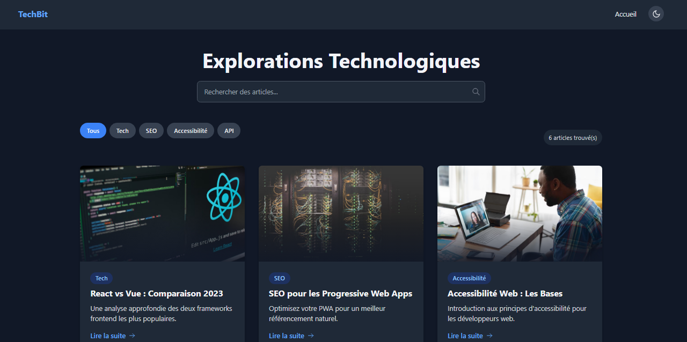

# TechBit - Mini Blog Technique



**TechBit** est un blog technique moderne développé avec **React** et **Tailwind CSS**, conçu pour partager des articles sur le développement web, les technologies et les bonnes pratiques. Ce projet met en avant des interfaces utilisateur interactives, optimisées pour le SEO et l’accessibilité.

## Fonctionnalités

✨ **Articles techniques** : Affichage d’articles via des cartes modernes avec images et dégradés visuels.  
🔍 **Recherche en temps réel** : Filtrage dynamique par titre ou contenu.  
🏷️ **Filtrage par catégorie** : Organisation par thèmes (Tech, SEO, Accessibilité, etc.).  
❤️ **Système de likes** : Un like par utilisateur avec option de déliker, persistant via localStorage.  
💬 **Commentaires** : Ajout et affichage de commentaires persistants pour chaque article.  
📱 **Responsive Design** : Adapté à tous les écrans (mobile, tablette, desktop).  
⚡ **Performances optimisées** : Construit avec Vite pour un chargement rapide.  
🌈 **UI moderne** : Design soigné avec Tailwind CSS et effets visuels (ombres internes, dégradés).  
📊 **SEO** : Balises meta dynamiques avec react-helmet pour une meilleure indexation.  
♿ **Accessibilité** : Respect des normes WCAG (ARIA, navigation clavier, contraste).

## Technologies

- ⚛️ **React** 19
- 🎨 **Tailwind CSS** 4
- ⚡ **Vite** 6
- 🚀 **React Router** 7
- 📦 **react-helmet** (SEO)
- 💾 **localStorage** (persistance des likes et commentaires)

## Installation

1. Cloner le dépôt :
```bash
git clone https://github.com/Thomah6/techbit.git
cd techbit
```

2. Installer les dépendances :
```bash
npm install
```

3. Lancer l’environnement de développement :
```bash
npm run dev
```

## Déploiement

Pour déployer sur **GitHub Pages** :

1. Installer `gh-pages` :
```bash
npm install gh-pages --save-dev
```

2. Ajouter dans `package.json` :
```json
"homepage": "[https://techbitblog.netlify.app/](https://techbitblog.netlify.app/)",
"scripts": {
  "predeploy": "npm run build",
  "deploy": "gh-pages -d dist"
}
```

3. Déployer :
```bash
npm run deploy
```

## Structure du projet

```
techbit/
├── public/          # Assets publics (images, favicon)
├── src/
│   ├── components/  # Composants React (ArticleCard, SearchBar, etc.)
│   ├── pages/       # Pages (Home, ArticleDetail)
│   ├── data/        # Données mock (articles.js)
│   ├── App.jsx      # Composant principal
│   └── main.jsx     # Point d’entrée
├── vite.config.js   # Configuration Vite
├── tailwind.config.js # Configuration Tailwind
└── README.md        # Documentation
```

## Contribuer

Les contributions sont les bienvenues !  
1. Forkez le projet.  
2. Créez une branche (`git checkout -b feature/ma-fonctionnalite`).  
3. Commitez vos changements (`git commit -m 'Ajout d’une fonctionnalité'`).  
4. Pushez vers la branche (`git push origin feature/ma-fonctionnalite`).  
5. Ouvrez une Pull Request.

## Licence

Distribué sous licence **MIT**. Voir `LICENSE` pour plus d’informations.

---

**Auteur** : Hermès Hounkonnou  
**Lien** : [https://techbitblog.netlify.app/](https://techbitblog.netlify.app/)  
**Portfolio** : [https://hermesh.x10.mx](https://hermesh.x10.mx)  
**GitHub** : [https://github.com/Thomah6](https://github.com/Thomah6)  
**Version** : 1.1.0  

💻 **Codez avec passion !**
```
